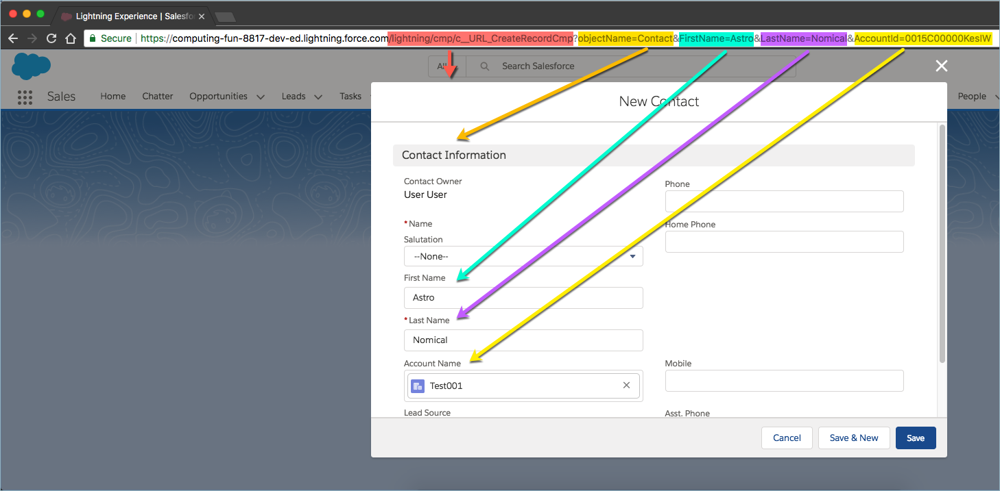

Inspired by [Brian Kwong](https://twitter.com/Kwongerific)'s [blog post](https://thewizardnews.com/2018/08/02/url-hack-functionality-lightning/)
on "URL Hacking" with supported features in Lightning Experience. 

This project's purpose is to determine a way to provide the "URL Hacking" in Lightning Experience
with supported features in Lightning Experience but without the need of a Flow so that we can have
a reusable solution for any object and supporting arbitrary number of fields and data types.
This is actually one of the wish items Brian talks about at the end of his blog post.

In Summer '18, a new interface was introduced, `lightning:isUrlAddressable`, which allows us to
create URLs and pass arbitrary parameters to Lightning Components. Great! So that part is done, no
need for Flow, we can create URL buttons similar to how we did in Classic so many moons ago.

However, by navigating to this lightning component as a URL, you are navigating away from the original
record page you were on when you clicked the button. The problem with that is there is no way to control
what happens when the user clicks the **cancel** or **save** buttons in the modal dialog. Meaning, there
is no way to return the user back to where they were in my approach. Womp, womp...

Please vote for the `force:recordCreate` event to expose callbacks to customize the modal dialog button behavior:
* [Callback method for force:createRecord event to redirect or refresh after save](https://success.salesforce.com/ideaView?id=0873A0000003V4hQAE)
* [Allow redirect after creating a new record using force:createRecord](https://success.salesforce.com/ideaView?id=0873A0000003VnmQAE)
